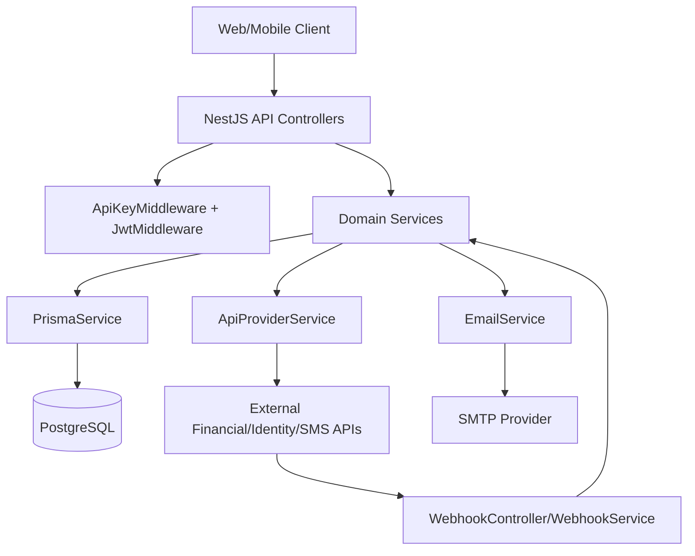

# Architecture

## High-Level Component Map

## Module-Level Layout
- `AuthModule`: login, passcode login, 2FA verification.
- `UserModule`: registration, profile management, KYC, password/pin/passcode operations, beneficiary and stats lookups.
- `WalletModule`: account verification, transfer, bank lookup/matching, QR generation/decoding, BVN face verification.
- `BillModule`: plan retrieval and bill/gift-card purchases.
- `WebhookModule`: partner callback ingestion and dispatch.
- `AdminModule`: plan catalog management endpoints.
- `ApiProvidersModule`: integration facade and individual provider adapters.
- `EmailModule`: SMTP transport + template rendering.
- `PrismaModule`: DB client access.
- `HealthModule`: liveness endpoint.

## Data Layer
Primary models in `prisma/schema.prisma`:
- `User`
- `Wallet`
- `Transaction`
- `Beneficiary`
- `PaymentEvent`
- Plan tables (`AirtimePlan`, `DataPlan`, `CablePlan`, `ElectricityPlan`, `InternetservicePlan`, `TransportPlan`, `SchoolfeePlan`)
- `ScamTicket`
- Cache tables (`BankAccountCache`, `BankNameCache`)

Enums encode domain constraints like account type, KYC tier, transaction status/type/category, bill type, network, and role.

## Integration Pattern
`ApiProviderService` acts as the orchestration/facade layer and delegates to provider-specific services:
- Banking/transfers/accounts: Bell MFB, SafeHaven, VFD, Flutterwave
- Identity/KYC: Dojah, QoreID, Smile ID
- Bill rails: Reloadly
- Messaging: Termii, AWS, Sendar (selected through helper service)
- Foreign account capabilities: Graph

This keeps domain services (`UserService`, `WalletService`, `BillService`) mostly provider-agnostic.

## Key Flows

### 1) Authentication
1. `AuthController` receives credentials.
2. `AuthService` validates user and password/passcode.
3. If 2FA enabled, OTP is sent by email/SMS and verified before token issuance.
4. JWT includes token version; middleware enforces version match.

### 2) Wallet Transfer
1. `WalletController.initiate-transfer` receives transfer request.
2. `WalletService` validates user, wallet state, pin/limits, and beneficiary behavior.
3. Transfer delegates through provider abstraction.
4. Transaction record is created/updated in Prisma.

### 3) Bill Payment
1. Client fetches plans/variations.
2. Pay endpoint triggers `BillService.pay(...)` with bill type.
3. Service resolves provider call, applies fees, persists transaction, and optionally stores beneficiary.

### 4) Webhooks
1. Provider POSTs to `/api/v1/webhook/*`.
2. Controller validates signature when configured.
3. `WebhookService` dispatches to provider handler.
4. Handler updates transaction/payment state.

## Cross-Cutting Concerns
- Error handling: global `AllExceptionsFilter`.
- Validation: DTOs + global `ValidationPipe`.
- Configuration safety: required env vars enforced with Joi at startup.
- Templates: Handlebars email templates under `src/templates`.
