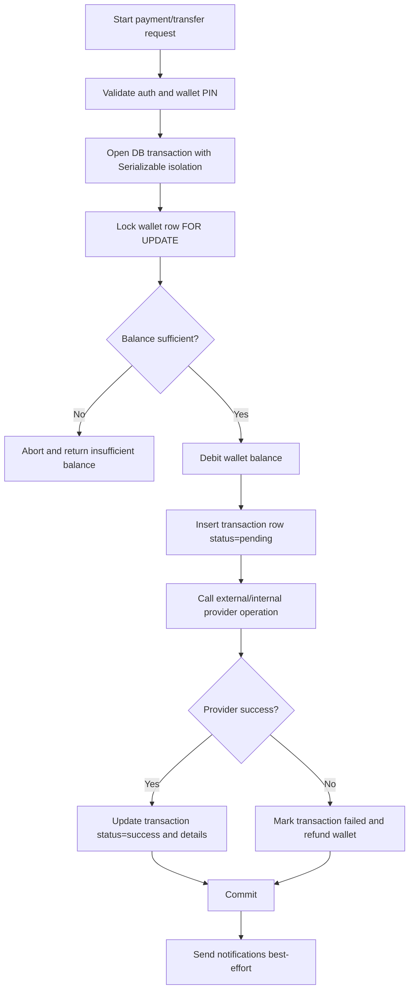
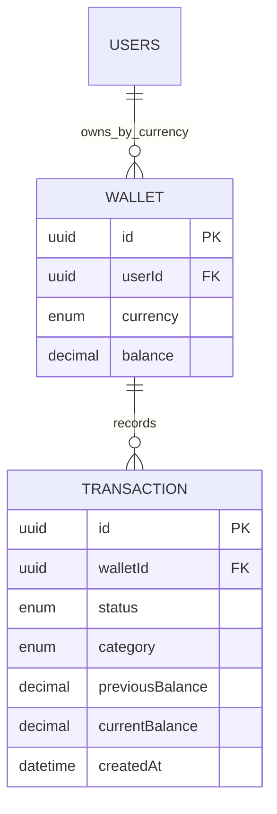

# Database Design (Current-State + Operational Guidance)

## Purpose
This document explains the backend relational data design represented in `prisma/schema.prisma`, why each table exists, and how high-risk flows (wallet movement and bill purchase) preserve consistency.

The design target is:
- correctness for money movement,
- traceable transaction history,
- simple operational support for catalog and beneficiary-driven bill flows,
- compatibility with current API behavior under `docs/02-api`.

## Database Technology and Access Pattern
- Engine: PostgreSQL (via Prisma ORM).
- ID strategy: UUID primary keys on core entities.
- Time tracking: `createdAt` and `updatedAt` on most mutable tables.
- Monetary fields: currently `Float` in schema for balances and amounts.
- Domain enums are persisted through Prisma enums (account type, transaction status/category/type, bill type, etc.).

## Design Principles Used
- User-centric ownership: most domain records are anchored to `users` through foreign keys.
- Wallet as ledger anchor: all wallet-affecting writes produce transaction records.
- Catalog isolation: bill plan tables are independent catalogs managed by admin APIs.
- Fast retrieval for repeated lookups: bank verification/name caches reduce provider calls.
- Event capture for funding providers: webhook/payment outcomes persist in `paymentEvent`.

## Core Tables and Roles

### `users`
Primary identity, auth state, KYC state, limits, and profile metadata.

Responsibilities:
- Login coordinates (`email`, `username`, `phoneNumber`) with uniqueness constraints.
- Security state: `password`, `passcode`, `walletPin`, 2FA and verification flags.
- Compliance state: BVN/NIN/address verification fields and tier (`tierLevel`).
- Runtime controls: `tokenVersion`, `status`, and transaction/cumulative limit fields.
- Role and account model: `role`, `accountType`, `isBusiness`, business registration flags.

Important constraints:
- Unique: `email`, `username`, `phoneNumber`.
- 1-to-many to beneficiaries and scam tickets.
- One wallet relation at Prisma level (see note in wallet section).

### `wallet`
Holds spendable balance and receiving-account metadata.

Responsibilities:
- Current balance by wallet.
- Provider account metadata (`accountNumber`, `bankCode`, etc.).
- Parent user reference.

Important constraints:
- `userId` is currently unique, which means one persisted wallet row per user.
- `accountNumber` is unique and indexed.
- CASCADE delete from `users`.

Design implication:
- APIs expose foreign-account creation, but schema currently enforces one wallet row per user. Multi-currency-at-scale would require changing this uniqueness strategy.

### `transaction`
Canonical operational ledger for movement states.

Responsibilities:
- Captures status lifecycle (`pending`, `success`, `failed`).
- Captures movement class (`category`: transfer, bill payment, deposit) and direction (`type`: debit/credit).
- Stores balance snapshot (`previousBalance`, `currentBalance`) for audit readability.
- Stores provider payload fragments as JSON (`billDetails`, `transferDetails`, `depositDetails`).

Important constraints:
- FK to `wallet` with cascade delete.
- No uniqueness constraint on `transactionRef`/`reference` in current schema, so idempotency must be enforced in service logic.

### `beneficiary`
User-saved destinations for transfer and bill flows.

Responsibilities:
- `type=TRANSFER`: stores bank account beneficiary details.
- `type=BILL`: stores bill-specific addressability (network/biller/operator fields).
- Optional currency pinning for future filtering.

Important constraints:
- FK to `users` with cascade delete.
- No compound uniqueness indexes, so duplicate suppression currently depends on service-level checks.

### Bill Plan Catalog Tables
- `airtimePlan`
- `dataPlan`
- `cablePlan`
- `electricityPlan`
- `internetservicePlan`
- `transportPlan`
- `schoolfeePlan`

Responsibilities:
- Store configurable plan metadata for each bill product group.
- Used by bill plan and variation discovery endpoints.

Important characteristics:
- Similar shape across plan tables with category-specific fields.
- Write path is admin API.
- Read path is user bill discovery endpoints.

### `paymentEvent`
Webhook/provider payment state capture.

Responsibilities:
- Persists provider-side settlement and fee context by reference.
- Supports reconciliation and operational debugging.

### `scamTicket`
User-reported safety ticket artifacts.

Responsibilities:
- Stores ticket sequence (`ref_number`), title, evidence URL, status and optional description.
- Supports user safety/support pipeline.

### Caches
- `BankAccountCache` (`accountNumber` unique)
- `BankNameCache` (`bankCode` unique, indexed by code and name)

Responsibilities:
- Reduce repeated provider verification/name-lookup calls.
- Improve latency and resilience for transfer/bank UX.

## Current Relational Model (Mermaid ER)
```mermaid
erDiagram
  USERS ||--o| WALLET : owns
  USERS ||--o{ BENEFICIARY : saves
  USERS ||--o{ SCAMTICKET : raises
  WALLET ||--o{ TRANSACTION : records

  USERS {
    uuid id PK
    string email UK
    string username UK
    string phoneNumber UK
    string fullname
    enum accountType
    enum role
    enum status
    enum tierLevel
    float dailyCummulativeTransactionLimit
    float cummulativeBalanceLimit
    int tokenVersion
    bool enabledTwoFa
    datetime createdAt
    datetime updatedAt
  }

  WALLET {
    uuid id PK
    uuid userId FK UK
    float balance
    enum currency
    string accountNumber UK
    string accountName
    string bankName
    string bankCode
    datetime createdAt
    datetime updatedAt
  }

  TRANSACTION {
    uuid id PK
    uuid walletId FK
    string transactionRef
    enum type
    enum category
    string currency
    enum status
    float previousBalance
    float currentBalance
    string reference
    json billDetails
    json transferDetails
    json depositDetails
    datetime createdAt
    datetime updatedAt
  }

  BENEFICIARY {
    uuid id PK
    uuid userId FK
    enum type
    string bankName
    string bankCode
    string accountNumber
    string accountName
    enum network
    enum billType
    string billerNumber
    int operatorId
    string billerCode
    string itemCode
    enum currency
    datetime createdAt
    datetime updatedAt
  }

  SCAMTICKET {
    uuid id PK
    uuid userId FK
    int ref_number
    string title
    string screenshotImageUrl
    enum status
    string description
    datetime createdAt
    datetime updatedAt
  }
```

## Catalog and Auxiliary Model

```mermaid
erDiagram
  PAYMENTEVENT {
    uuid id PK
    string refId
    string status
    string currency
    float amountPaid
    float settlementAmount
    float fee
    datetime createdAt
    datetime updatedAt
  }

  AIRTIMEPLAN {
    uuid id PK
    string planName
    enum network
    string countryISOCode
    int operatorId
    datetime createdAt
    datetime updatedAt
  }

  DATAPLAN {
    uuid id PK
    enum network
    string planName
    string countryISOCode
    int operatorId
    datetime createdAt
    datetime updatedAt
  }

  CABLEPLAN {
    uuid id PK
    string planName
    string countryISOCode
    string billerCode
    string shortName
  }

  ELECTRICITYPLAN {
    uuid id PK
    string planName
    string countryISOCode
    string billerCode
    string shortName
  }

  INTERNETSERVICEPLAN {
    uuid id PK
    string planName
    string countryISOCode
    string billerCode
    string shortName
  }

  TRANSPORTPLAN {
    uuid id PK
    string planName
    string countryISOCode
    string billerCode
    string shortName
  }

  SCHOOLFEEPLAN {
    uuid id PK
    string planName
    string countryISOCode
    string billerCode
    string shortName
  }

  BANKACCOUNTCACHE {
    string id PK
    string accountNumber UK
    string accountName
    string bankCode
    datetime verifiedAt
  }

  BANKNAMECACHE {
    string id PK
    string bankCode UK
    string bankName
    datetime createdAt
    datetime updatedAt
  }
```


## Transaction Safety Pattern (Wallet-Impacting Flows)
The service layer uses serializable transactions with row locking and retry on serialization conflicts.



## Data Integrity Notes and Tradeoffs
- Strong point: monetary paths are recorded in `transaction` with pre/post balance snapshots.
- Strong point: FK/CASCADE relationships keep user-owned graph clean during deletions.
- Tradeoff: `Float` for money may introduce precision risk at scale; fixed-point decimal is safer long-term.
- Tradeoff: single-wallet uniqueness (`wallet.userId @unique`) limits multi-wallet-per-user expansion.
- Tradeoff: missing DB-level idempotency constraints on references means duplicate prevention depends on service logic.
- Tradeoff: beneficiary duplication is prevented by query checks, not unique composite indexes.

## Recommended Index and Constraint Upgrades
If/when you evolve schema for scale and stricter consistency:
- Add partial/compound indexes for transaction reporting, e.g. `(walletId, createdAt)` and `(status, category, createdAt)`.
- Add optional unique index on external provider reference where guaranteed unique.
- Add beneficiary de-dup indexes, such as:
- transfer beneficiaries: `(userId, type, accountNumber, bankCode)`.
- bill beneficiaries: `(userId, type, billType, billerNumber, operatorId)`.
- Migrate monetary fields from `Float` to decimal type (`Decimal` in Prisma / `NUMERIC` in Postgres).
- For multi-currency wallets, replace `wallet.userId @unique` with `@@unique([userId, currency])`.

## Suggested Future-State ERD for Multi-Currency Wallets


## Mapping to API Domains
- Auth/User domain: primarily `users` (+ caches for verification helpers).
- Wallet domain: `wallet`, `transaction`, `beneficiary`, bank caches.
- Bill domain: plan tables + `beneficiary` + `transaction`.
- Admin domain: writes plan tables.
- Webhook domain: `paymentEvent` and downstream wallet transaction handling.

## Operational Checklist for New Features
Before adding any wallet-impacting feature:
1. Define idempotency key and where it is persisted.
2. Ensure pending -> terminal status transitions are explicit.
3. Keep debit/refund logic in a single transactional boundary.
4. Emit enough JSON detail in `transaction` to support reconciliation.
5. Add query/index support for expected dashboard/report usage.
