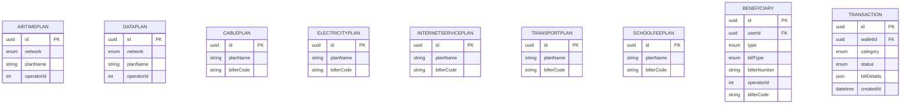
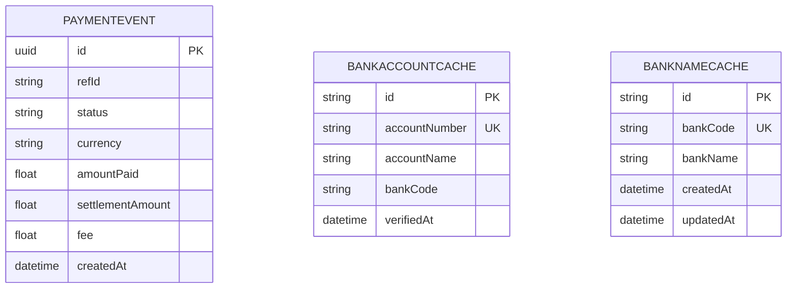
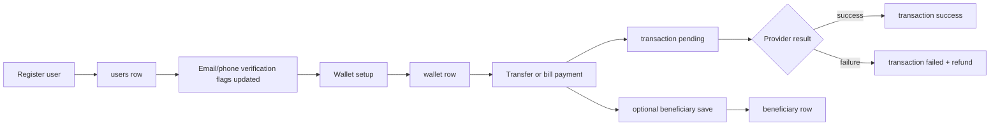
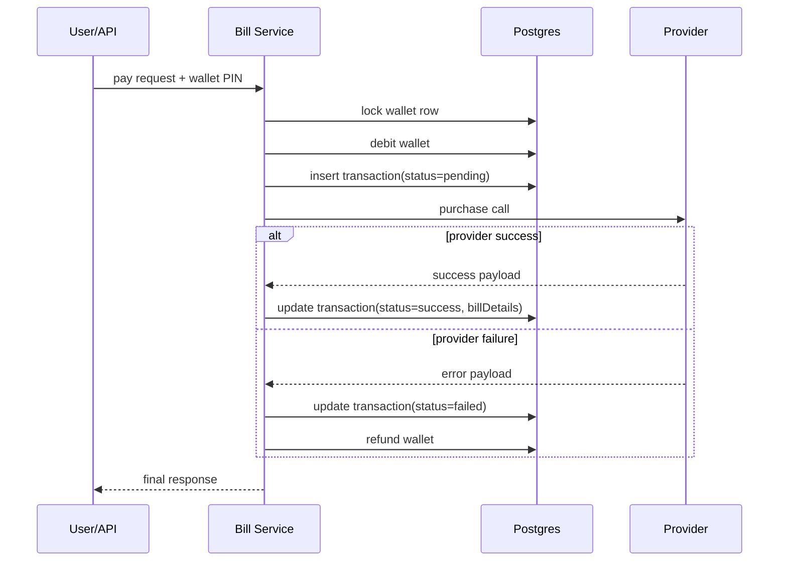

# ERD Reference (Ubi Backend)

## How to Read This File
- This is a visual-first companion to `db-design.md`.
- It focuses on relationship diagrams and lifecycle diagrams.
- Field lists are intentionally compact to keep diagrams readable.

## Legend
- `||--o|`: one-to-zero-or-one
- `||--o{`: one-to-many
- `PK`: primary key
- `FK`: foreign key
- `UK`: unique key

## Core Domain ERD
```mermaid
erDiagram
  USERS ||--o| WALLET : has
  USERS ||--o{ BENEFICIARY : saves
  USERS ||--o{ SCAMTICKET : creates
  WALLET ||--o{ TRANSACTION : contains

  USERS {
    uuid id PK
    string email UK
    string username UK
    string phoneNumber UK
    enum accountType
    enum status
    enum tierLevel
    enum role
    datetime createdAt
    datetime updatedAt
  }

  WALLET {
    uuid id PK
    uuid userId FK UK
    enum currency
    float balance
    string accountNumber UK
    datetime createdAt
    datetime updatedAt
  }

  TRANSACTION {
    uuid id PK
    uuid walletId FK
    enum type
    enum category
    enum status
    string currency
    string transactionRef
    string reference
    datetime createdAt
    datetime updatedAt
  }

  BENEFICIARY {
    uuid id PK
    uuid userId FK
    enum type
    enum billType
    string accountNumber
    string bankCode
    string billerNumber
    int operatorId
    datetime createdAt
    datetime updatedAt
  }

  SCAMTICKET {
    uuid id PK
    uuid userId FK
    int ref_number
    enum status
    datetime createdAt
  }
```

## Bill and Catalog ERD


## Webhook and Cache ERD


## User Lifecycle to Data Touchpoints


## Bill Payment Sequence and Table Writes


## Data Ownership Summary
- User-owned and cascade-deleted: `wallet`, `beneficiary`, `scamTicket`, and indirectly user-linked `transaction` through wallet.
- System-owned reference data: all bill plan catalog tables.
- Integration-owned event capture: `paymentEvent`.
- Ephemeral optimization data: bank caches.

## Modeling Notes for Team Alignment
- Current wallet relation is one user to at most one wallet row.
- Transactions are the operational source of truth for movement history.
- JSON detail fields intentionally preserve provider payload context without frequent schema churn.
- If you adopt multi-currency wallets, update ERD cardinality to one user to many wallets.
