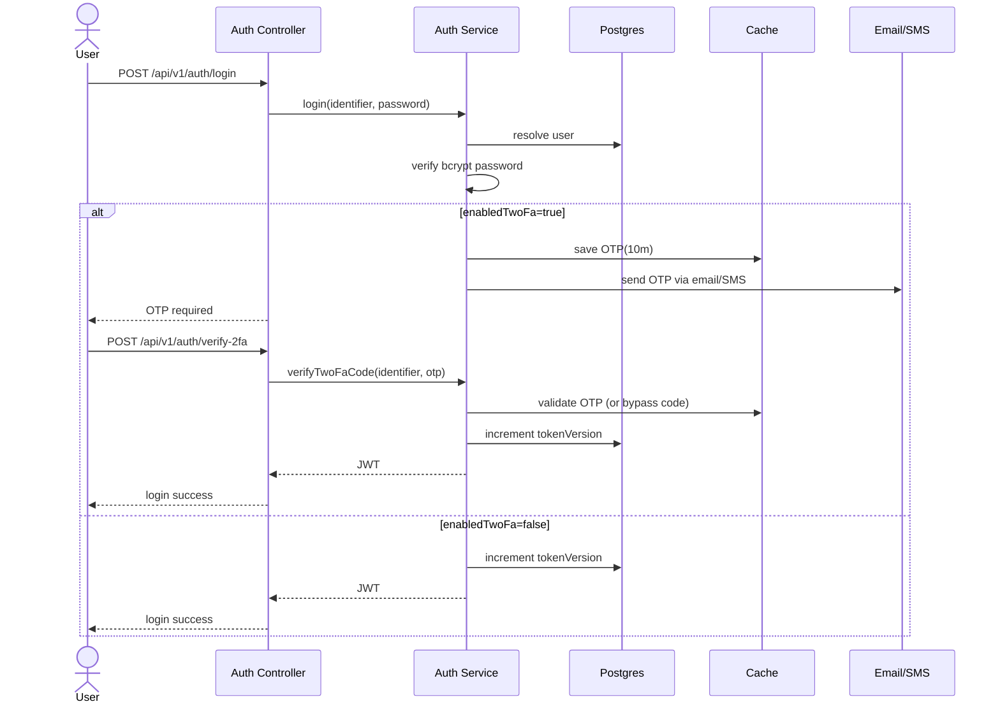

# Key Flow: 2FA Login Journey

```mermaid
sequenceDiagram
  actor U as User
  participant API as Auth Controller
  participant S as Auth Service
  participant DB as Postgres
  participant C as Cache
  participant N as Email/SMS

  U->>API: POST /api/v1/auth/login
  API->>S: login(identifier, password)
  S->>DB: resolve user
  S->>S: verify bcrypt password
  alt enabledTwoFa=true
    S->>C: save OTP(10m)
    S->>N: send OTP via email/SMS
    API-->>U: OTP required
    U->>API: POST /api/v1/auth/verify-2fa
    API->>S: verifyTwoFaCode(identifier, otp)
    S->>C: validate OTP (or bypass code)
    S->>DB: increment tokenVersion
    S-->>API: JWT
    API-->>U: login success
  else enabledTwoFa=false
    S->>DB: increment tokenVersion
    S-->>API: JWT
    API-->>U: login success
  end
```
