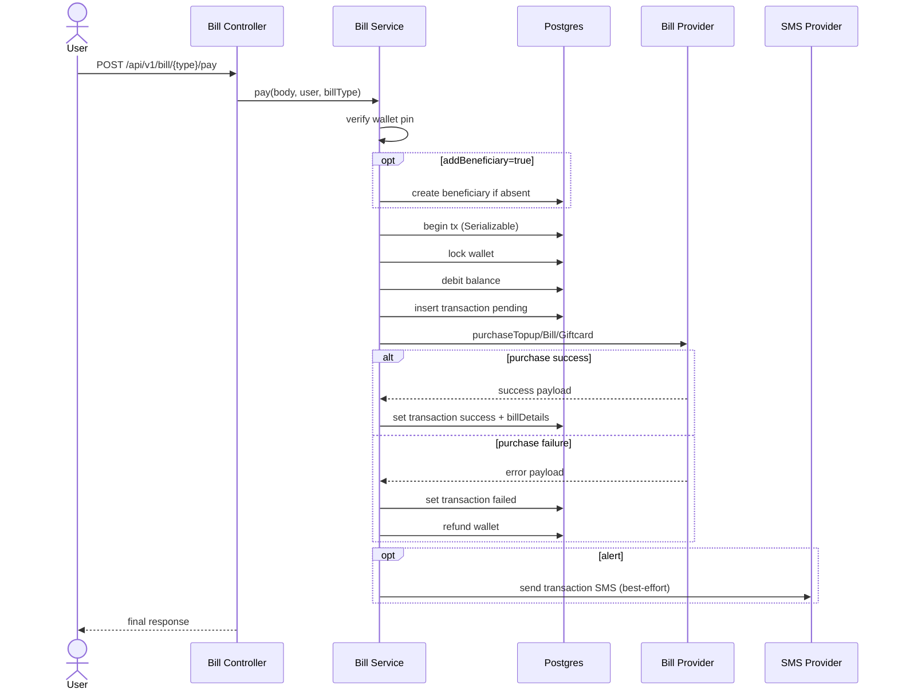

# Key Flow: Bill Payment Engine

```mermaid
sequenceDiagram
  actor U as User
  participant API as Bill Controller
  participant S as Bill Service
  participant DB as Postgres
  participant P as Bill Provider
  participant SMS as SMS Provider

  U->>API: POST /api/v1/bill/{type}/pay
  API->>S: pay(body, user, billType)
  S->>S: verify wallet pin
  opt addBeneficiary=true
    S->>DB: create beneficiary if absent
  end
  S->>DB: begin tx (Serializable)
  S->>DB: lock wallet
  S->>DB: debit balance
  S->>DB: insert transaction pending
  S->>P: purchaseTopup/Bill/Giftcard
  alt purchase success
    P-->>S: success payload
    S->>DB: set transaction success + billDetails
  else purchase failure
    P-->>S: error payload
    S->>DB: set transaction failed
    S->>DB: refund wallet
  end
  opt alert
    S->>SMS: send transaction SMS (best-effort)
  end
  API-->>U: final response
```
