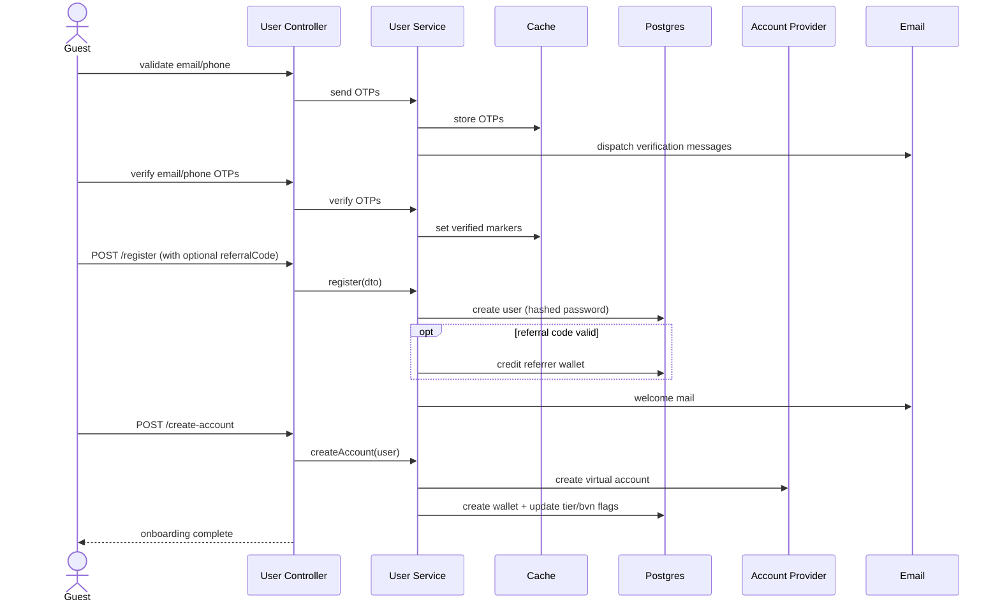

# Key Flow: Onboarding with Referral and Wallet Setup

```mermaid
sequenceDiagram
  actor G as Guest
  participant API as User Controller
  participant S as User Service
  participant C as Cache
  participant DB as Postgres
  participant P as Account Provider
  participant E as Email

  G->>API: validate email/phone
  API->>S: send OTPs
  S->>C: store OTPs
  S->>E: dispatch verification messages

  G->>API: verify email/phone OTPs
  API->>S: verify OTPs
  S->>C: set verified markers

  G->>API: POST /register (with optional referralCode)
  API->>S: register(dto)
  S->>DB: create user (hashed password)
  opt referral code valid
    S->>DB: credit referrer wallet
  end
  S->>E: welcome mail

  G->>API: POST /create-account
  API->>S: createAccount(user)
  S->>P: create virtual account
  S->>DB: create wallet + update tier/bvn flags
  API-->>G: onboarding complete
```
