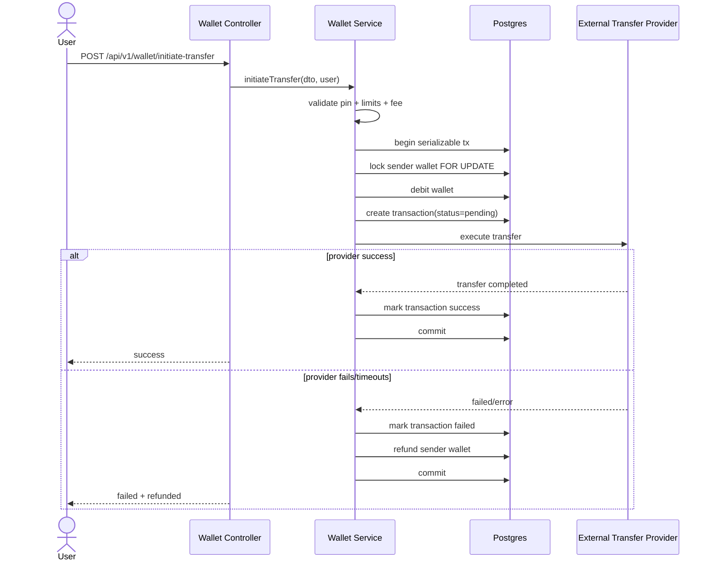

# Key Flow: External Transfer with Failure Refund

```mermaid
sequenceDiagram
  actor U as User
  participant API as Wallet Controller
  participant S as Wallet Service
  participant DB as Postgres
  participant X as External Transfer Provider

  U->>API: POST /api/v1/wallet/initiate-transfer
  API->>S: initiateTransfer(dto, user)
  S->>S: validate pin + limits + fee
  S->>DB: begin serializable tx
  S->>DB: lock sender wallet FOR UPDATE
  S->>DB: debit wallet
  S->>DB: create transaction(status=pending)
  S->>X: execute transfer
  alt provider success
    X-->>S: transfer completed
    S->>DB: mark transaction success
    S->>DB: commit
    API-->>U: success
  else provider fails/timeouts
    X-->>S: failed/error
    S->>DB: mark transaction failed
    S->>DB: refund sender wallet
    S->>DB: commit
    API-->>U: failed + refunded
  end
```
