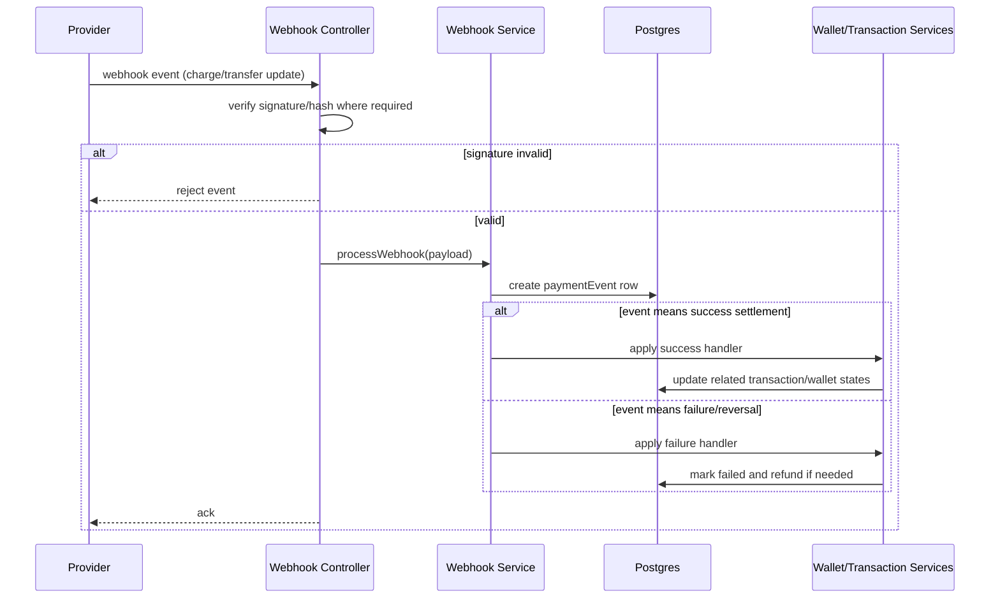

# Key Flow: Webhook Reconciliation

```mermaid
sequenceDiagram
  participant P as Provider
  participant API as Webhook Controller
  participant S as Webhook Service
  participant DB as Postgres
  participant W as Wallet/Transaction Services

  P->>API: webhook event (charge/transfer update)
  API->>API: verify signature/hash where required
  alt signature invalid
    API-->>P: reject event
  else valid
    API->>S: processWebhook(payload)
    S->>DB: create paymentEvent row
    alt event means success settlement
      S->>W: apply success handler
      W->>DB: update related transaction/wallet states
    else event means failure/reversal
      S->>W: apply failure handler
      W->>DB: mark failed and refund if needed
    end
    API-->>P: ack
  end
```
