# Sequence Diagrams for User Stories

This document maps user stories in `docs/01-product/user-stories.md` to executable sequence-style flows.

## 0) End-to-End Product Flow Overview
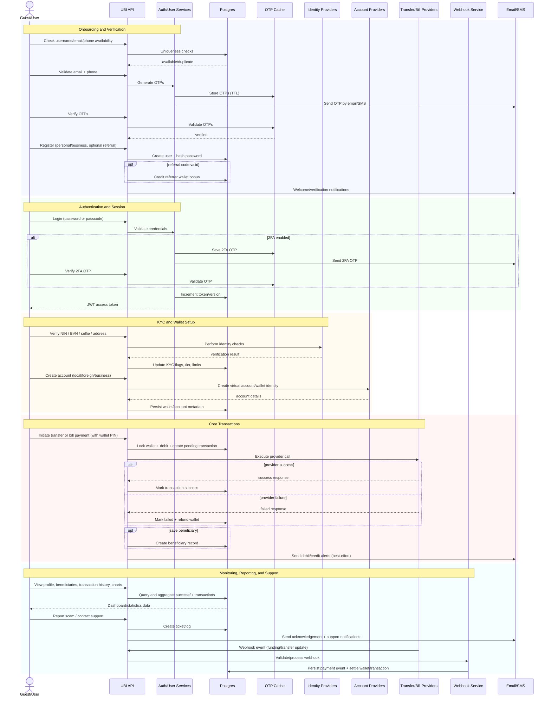
```mermaid
sequenceDiagram
  actor G as Guest/User
  participant API as UBI API
  participant AUTH as Auth/User Services
  participant DB as Postgres
  participant CACHE as OTP Cache
  participant KYC as Identity Providers
  participant ACC as Account Providers
  participant PAY as Transfer/Bill Providers
  participant WH as Webhook Service
  participant NOTIF as Email/SMS

  rect rgb(245, 248, 255)
    Note over G,AUTH: Onboarding and Verification
    G->>API: Check username/email/phone availability
    API->>DB: Uniqueness checks
    DB-->>API: available/duplicate

    G->>API: Validate email + phone
    API->>AUTH: Generate OTPs
    AUTH->>CACHE: Store OTPs (TTL)
    AUTH->>NOTIF: Send OTP by email/SMS

    G->>API: Verify OTPs
    API->>CACHE: Validate OTPs
    CACHE-->>API: verified

    G->>API: Register (personal/business, optional referral)
    API->>DB: Create user + hash password
    opt referral code valid
      API->>DB: Credit referrer wallet bonus
    end
    API->>NOTIF: Welcome/verification notifications
  end

  rect rgb(245, 255, 245)
    Note over G,AUTH: Authentication and Session
    G->>API: Login (password or passcode)
    API->>AUTH: Validate credentials
    alt 2FA enabled
      AUTH->>CACHE: Save 2FA OTP
      AUTH->>NOTIF: Send 2FA OTP
      G->>API: Verify 2FA OTP
      API->>CACHE: Validate OTP
    end
    AUTH->>DB: Increment tokenVersion
    AUTH-->>G: JWT access token
  end

  rect rgb(255, 251, 240)
    Note over G,KYC: KYC and Wallet Setup
    G->>API: Verify NIN / BVN / selfie / address
    API->>KYC: Perform identity checks
    KYC-->>API: verification result
    API->>DB: Update KYC flags, tier, limits

    G->>API: Create account (local/foreign/business)
    API->>ACC: Create virtual account/wallet identity
    ACC-->>API: account details
    API->>DB: Persist wallet/account metadata
  end

  rect rgb(255, 245, 245)
    Note over G,PAY: Core Transactions
    G->>API: Initiate transfer or bill payment (with wallet PIN)
    API->>DB: Lock wallet + debit + create pending transaction
    API->>PAY: Execute provider call
    alt provider success
      PAY-->>API: success response
      API->>DB: Mark transaction success
    else provider failure
      PAY-->>API: failed response
      API->>DB: Mark failed + refund wallet
    end
    opt save beneficiary
      API->>DB: Create beneficiary record
    end
    API->>NOTIF: Send debit/credit alerts (best-effort)
  end

  rect rgb(245, 255, 255)
    Note over G,WH: Monitoring, Reporting, and Support
    G->>API: View profile, beneficiaries, transaction history, charts
    API->>DB: Query and aggregate successful transactions
    DB-->>G: Dashboard/statistics data

    G->>API: Report scam / contact support
    API->>DB: Create ticket/log
    API->>NOTIF: Send acknowledgement + support notifications

    PAY->>API: Webhook event (funding/transfer update)
    API->>WH: Validate/process webhook
    WH->>DB: Persist payment event + settle wallet/transaction
  end
```

## 1) Username/Email/Phone Existence Check
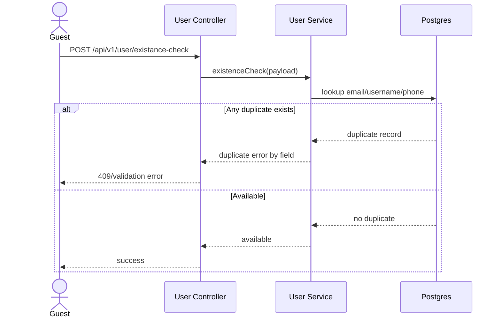
```mermaid
sequenceDiagram
  actor G as Guest
  participant API as User Controller
  participant S as User Service
  participant DB as Postgres

  G->>API: POST /api/v1/user/existance-check
  API->>S: existenceCheck(payload)
  S->>DB: lookup email/username/phone
  alt Any duplicate exists
    DB-->>S: duplicate record
    S-->>API: duplicate error by field
    API-->>G: 409/validation error
  else Available
    DB-->>S: no duplicate
    S-->>API: available
    API-->>G: success
  end
```

## 2) Email Validation and Verification
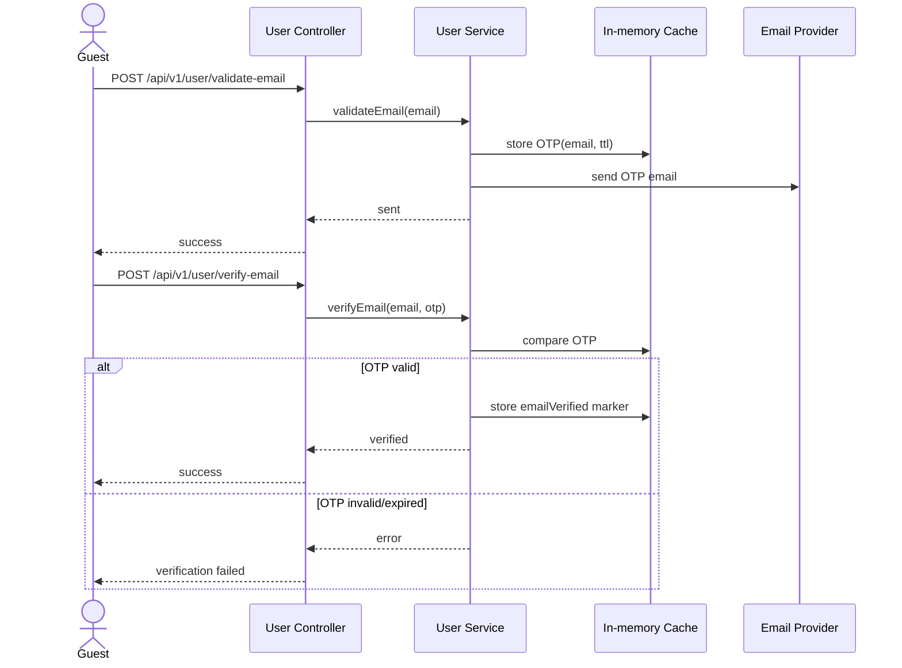
```mermaid
sequenceDiagram
  actor G as Guest
  participant API as User Controller
  participant S as User Service
  participant C as In-memory Cache
  participant E as Email Provider

  G->>API: POST /api/v1/user/validate-email
  API->>S: validateEmail(email)
  S->>C: store OTP(email, ttl)
  S->>E: send OTP email
  S-->>API: sent
  API-->>G: success

  G->>API: POST /api/v1/user/verify-email
  API->>S: verifyEmail(email, otp)
  S->>C: compare OTP
  alt OTP valid
    S->>C: store emailVerified marker
    S-->>API: verified
    API-->>G: success
  else OTP invalid/expired
    S-->>API: error
    API-->>G: verification failed
  end
```

## 3) Phone Validation and Verification
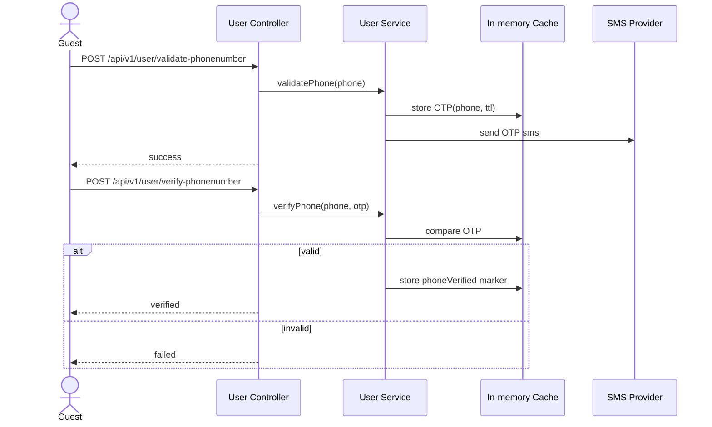
```mermaid
sequenceDiagram
  actor G as Guest
  participant API as User Controller
  participant S as User Service
  participant C as In-memory Cache
  participant SMS as SMS Provider

  G->>API: POST /api/v1/user/validate-phonenumber
  API->>S: validatePhone(phone)
  S->>C: store OTP(phone, ttl)
  S->>SMS: send OTP sms
  API-->>G: success

  G->>API: POST /api/v1/user/verify-phonenumber
  API->>S: verifyPhone(phone, otp)
  S->>C: compare OTP
  alt valid
    S->>C: store phoneVerified marker
    API-->>G: verified
  else invalid
    API-->>G: failed
  end
```

## 4) Register Personal Account (with Referral)
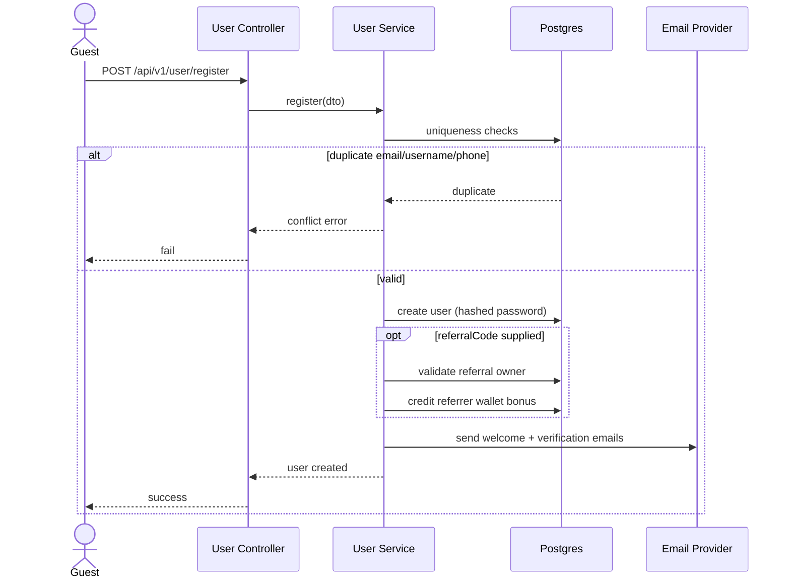
```mermaid
sequenceDiagram
  actor G as Guest
  participant API as User Controller
  participant S as User Service
  participant DB as Postgres
  participant E as Email Provider

  G->>API: POST /api/v1/user/register
  API->>S: register(dto)
  S->>DB: uniqueness checks
  alt duplicate email/username/phone
    DB-->>S: duplicate
    S-->>API: conflict error
    API-->>G: fail
  else valid
    S->>DB: create user (hashed password)
    opt referralCode supplied
      S->>DB: validate referral owner
      S->>DB: credit referrer wallet bonus
    end
    S->>E: send welcome + verification emails
    S-->>API: user created
    API-->>G: success
  end
```

## 5) Register Business Account
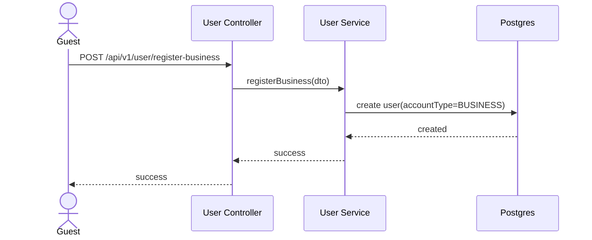
```mermaid
sequenceDiagram
  actor G as Guest
  participant API as User Controller
  participant S as User Service
  participant DB as Postgres

  G->>API: POST /api/v1/user/register-business
  API->>S: registerBusiness(dto)
  S->>DB: create user(accountType=BUSINESS)
  DB-->>S: created
  S-->>API: success
  API-->>G: success
```

## 6) Create Passcode
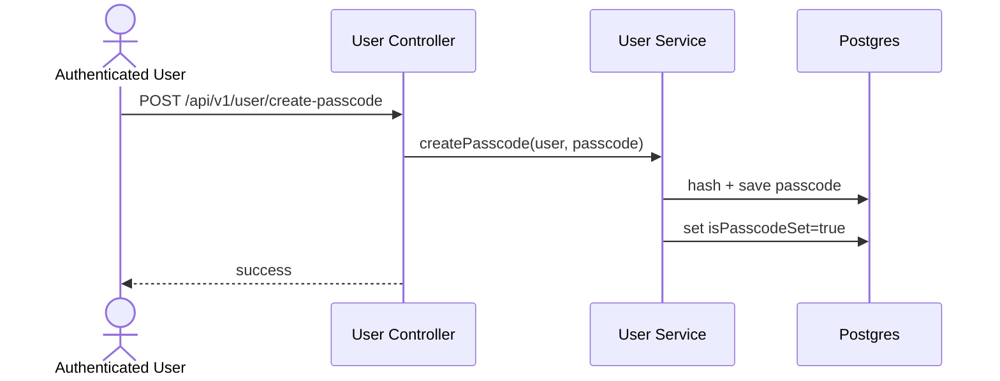
```mermaid
sequenceDiagram
  actor U as Authenticated User
  participant API as User Controller
  participant S as User Service
  participant DB as Postgres

  U->>API: POST /api/v1/user/create-passcode
  API->>S: createPasscode(user, passcode)
  S->>DB: hash + save passcode
  S->>DB: set isPasscodeSet=true
  API-->>U: success
```

## 7) Password Login with Optional 2FA
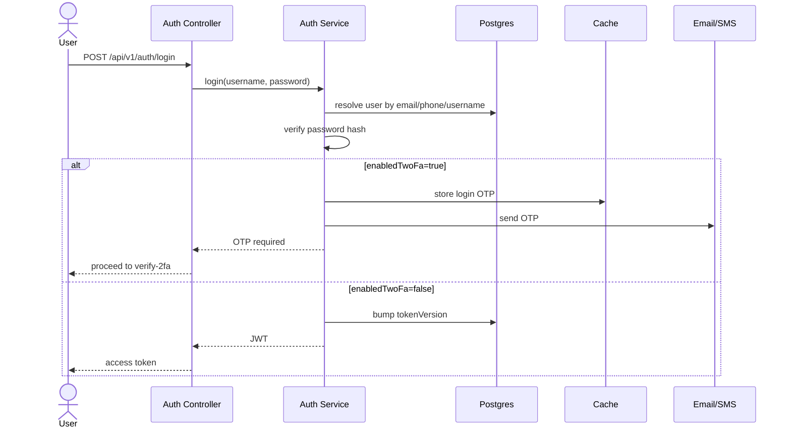
```mermaid
sequenceDiagram
  actor U as User
  participant API as Auth Controller
  participant S as Auth Service
  participant DB as Postgres
  participant C as Cache
  participant E as Email/SMS

  U->>API: POST /api/v1/auth/login
  API->>S: login(username, password)
  S->>DB: resolve user by email/phone/username
  S->>S: verify password hash
  alt enabledTwoFa=true
    S->>C: store login OTP
    S->>E: send OTP
    S-->>API: OTP required
    API-->>U: proceed to verify-2fa
  else enabledTwoFa=false
    S->>DB: bump tokenVersion
    S-->>API: JWT
    API-->>U: access token
  end
```

## 8) Passcode Login
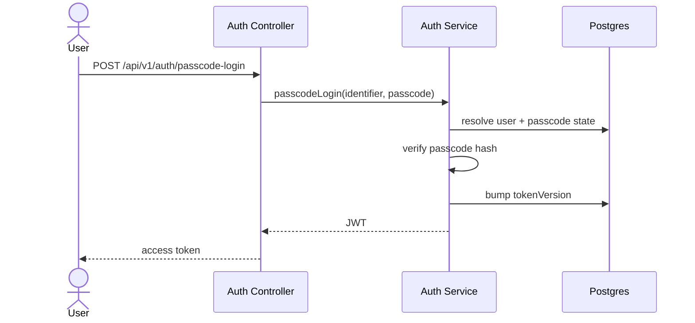
```mermaid
sequenceDiagram
  actor U as User
  participant API as Auth Controller
  participant S as Auth Service
  participant DB as Postgres

  U->>API: POST /api/v1/auth/passcode-login
  API->>S: passcodeLogin(identifier, passcode)
  S->>DB: resolve user + passcode state
  S->>S: verify passcode hash
  S->>DB: bump tokenVersion
  S-->>API: JWT
  API-->>U: access token
```

## 9) Resend and Verify 2FA
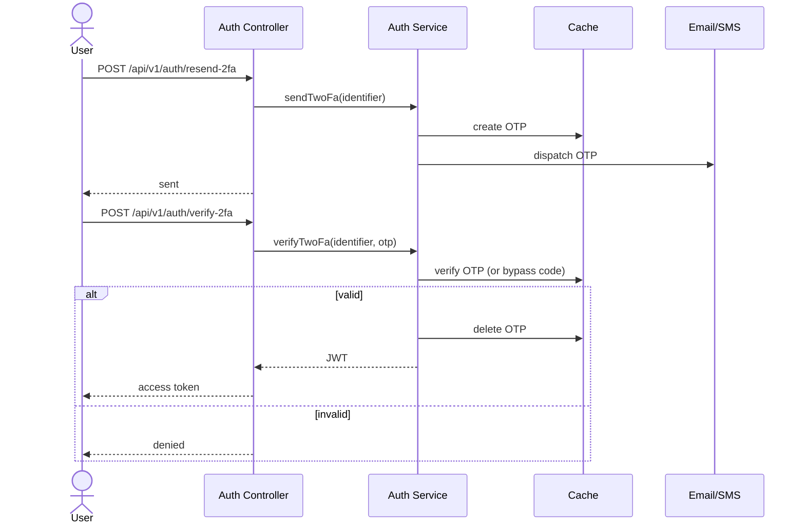
```mermaid
sequenceDiagram
  actor U as User
  participant API as Auth Controller
  participant S as Auth Service
  participant C as Cache
  participant N as Email/SMS

  U->>API: POST /api/v1/auth/resend-2fa
  API->>S: sendTwoFa(identifier)
  S->>C: create OTP
  S->>N: dispatch OTP
  API-->>U: sent

  U->>API: POST /api/v1/auth/verify-2fa
  API->>S: verifyTwoFa(identifier, otp)
  S->>C: verify OTP (or bypass code)
  alt valid
    S->>C: delete OTP
    S-->>API: JWT
    API-->>U: access token
  else invalid
    API-->>U: denied
  end
```

## 10) Forgot Password Flow
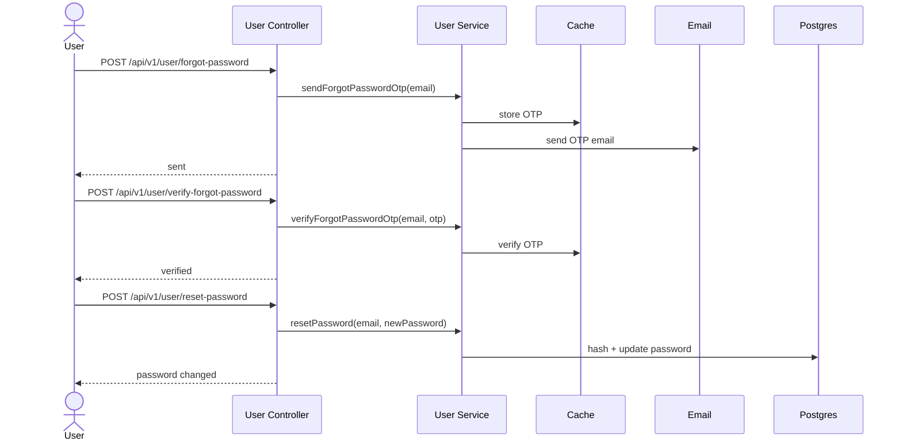
```mermaid
sequenceDiagram
  actor U as User
  participant API as User Controller
  participant S as User Service
  participant C as Cache
  participant E as Email
  participant DB as Postgres

  U->>API: POST /api/v1/user/forgot-password
  API->>S: sendForgotPasswordOtp(email)
  S->>C: store OTP
  S->>E: send OTP email
  API-->>U: sent

  U->>API: POST /api/v1/user/verify-forgot-password
  API->>S: verifyForgotPasswordOtp(email, otp)
  S->>C: verify OTP
  API-->>U: verified

  U->>API: POST /api/v1/user/reset-password
  API->>S: resetPassword(email, newPassword)
  S->>DB: hash + update password
  API-->>U: password changed
```

## 11) Change Password In-Session
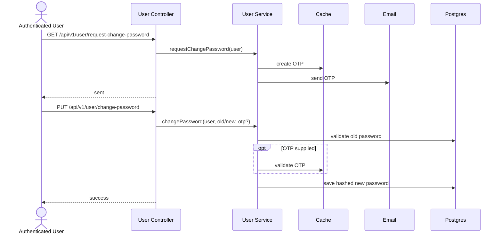
```mermaid
sequenceDiagram
  actor U as Authenticated User
  participant API as User Controller
  participant S as User Service
  participant C as Cache
  participant E as Email
  participant DB as Postgres

  U->>API: GET /api/v1/user/request-change-password
  API->>S: requestChangePassword(user)
  S->>C: create OTP
  S->>E: send OTP
  API-->>U: sent

  U->>API: PUT /api/v1/user/change-password
  API->>S: changePassword(user, old/new, otp?)
  S->>DB: validate old password
  opt OTP supplied
    S->>C: validate OTP
  end
  S->>DB: save hashed new password
  API-->>U: success
```

## 12) Change Passcode and PIN
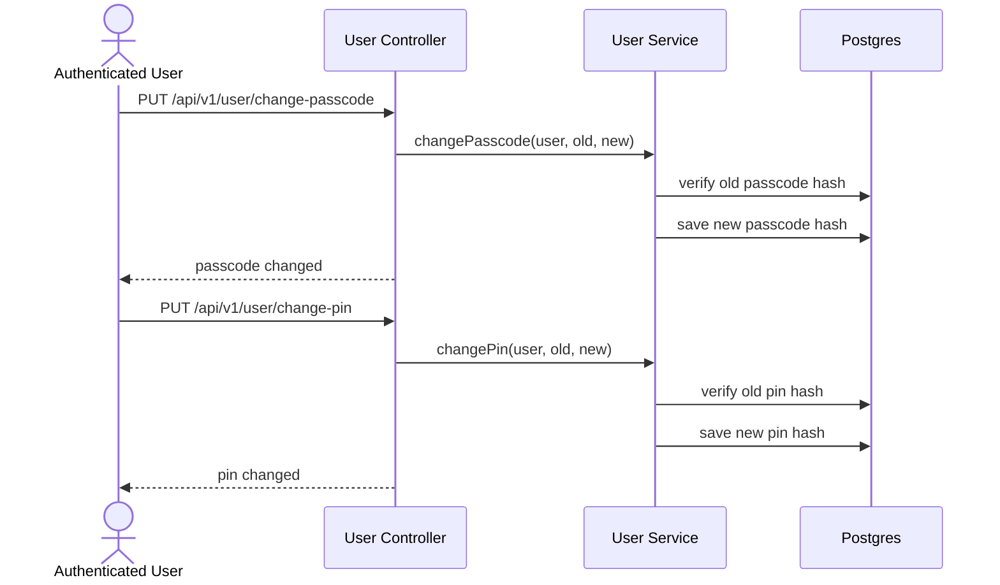
```mermaid
sequenceDiagram
  actor U as Authenticated User
  participant API as User Controller
  participant S as User Service
  participant DB as Postgres

  U->>API: PUT /api/v1/user/change-passcode
  API->>S: changePasscode(user, old, new)
  S->>DB: verify old passcode hash
  S->>DB: save new passcode hash
  API-->>U: passcode changed

  U->>API: PUT /api/v1/user/change-pin
  API->>S: changePin(user, old, new)
  S->>DB: verify old pin hash
  S->>DB: save new pin hash
  API-->>U: pin changed
```

## 13) Reset PIN (Forgot PIN)
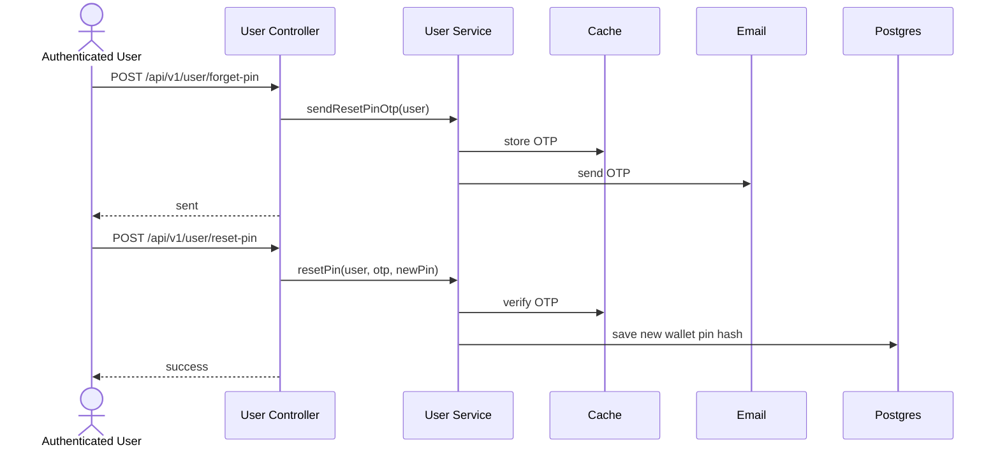
```mermaid
sequenceDiagram
  actor U as Authenticated User
  participant API as User Controller
  participant S as User Service
  participant C as Cache
  participant E as Email
  participant DB as Postgres

  U->>API: POST /api/v1/user/forget-pin
  API->>S: sendResetPinOtp(user)
  S->>C: store OTP
  S->>E: send OTP
  API-->>U: sent

  U->>API: POST /api/v1/user/reset-pin
  API->>S: resetPin(user, otp, newPin)
  S->>C: verify OTP
  S->>DB: save new wallet pin hash
  API-->>U: success
```

## 14) Profile Update
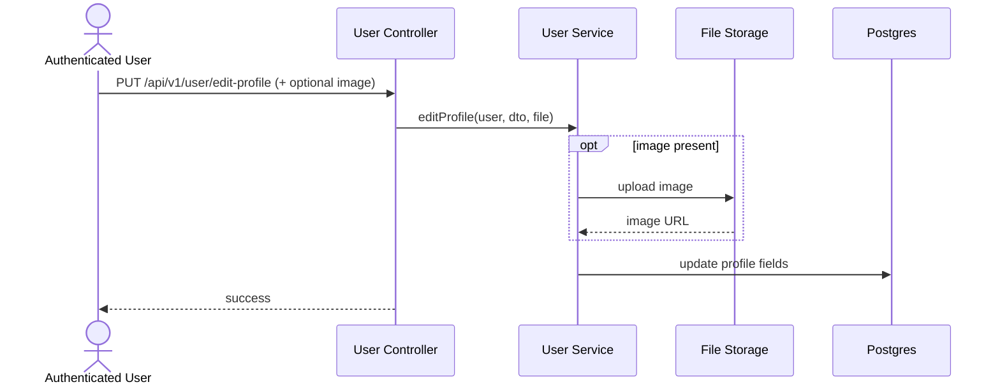
```mermaid
sequenceDiagram
  actor U as Authenticated User
  participant API as User Controller
  participant S as User Service
  participant F as File Storage
  participant DB as Postgres

  U->>API: PUT /api/v1/user/edit-profile (+ optional image)
  API->>S: editProfile(user, dto, file)
  opt image present
    S->>F: upload image
    F-->>S: image URL
  end
  S->>DB: update profile fields
  API-->>U: success
```

## 15) NIN Verification and KYC Tier Upgrades
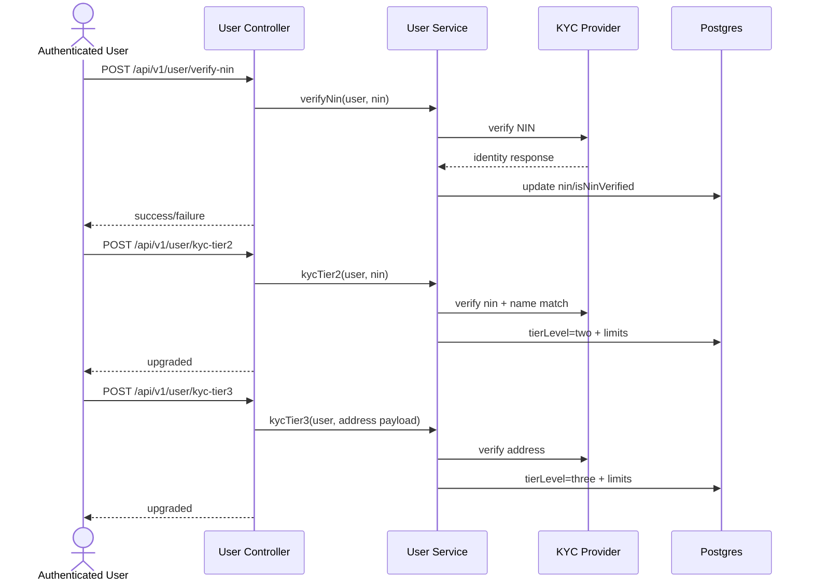
```mermaid
sequenceDiagram
  actor U as Authenticated User
  participant API as User Controller
  participant S as User Service
  participant K as KYC Provider
  participant DB as Postgres

  U->>API: POST /api/v1/user/verify-nin
  API->>S: verifyNin(user, nin)
  S->>K: verify NIN
  K-->>S: identity response
  S->>DB: update nin/isNinVerified
  API-->>U: success/failure

  U->>API: POST /api/v1/user/kyc-tier2
  API->>S: kycTier2(user, nin)
  S->>K: verify nin + name match
  S->>DB: tierLevel=two + limits
  API-->>U: upgraded

  U->>API: POST /api/v1/user/kyc-tier3
  API->>S: kycTier3(user, address payload)
  S->>K: verify address
  S->>DB: tierLevel=three + limits
  API-->>U: upgraded
```

## 16) Wallet Account Creation (NGN)
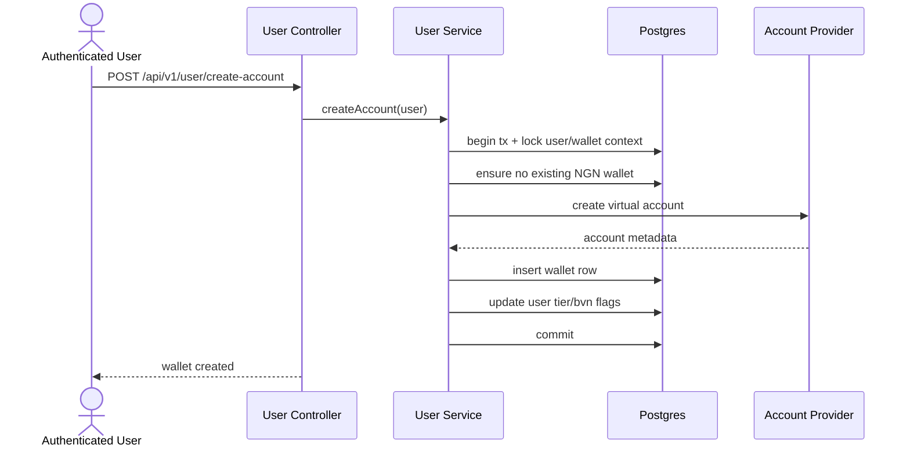
```mermaid
sequenceDiagram
  actor U as Authenticated User
  participant API as User Controller
  participant S as User Service
  participant DB as Postgres
  participant P as Account Provider

  U->>API: POST /api/v1/user/create-account
  API->>S: createAccount(user)
  S->>DB: begin tx + lock user/wallet context
  S->>DB: ensure no existing NGN wallet
  S->>P: create virtual account
  P-->>S: account metadata
  S->>DB: insert wallet row
  S->>DB: update user tier/bvn flags
  S->>DB: commit
  API-->>U: wallet created
```

## 17) Business Wallet Creation
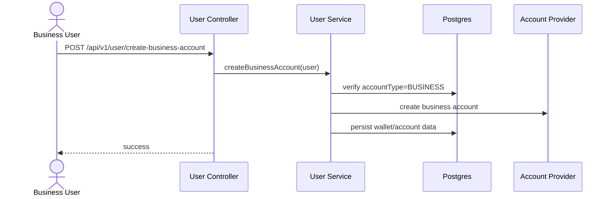
```mermaid
sequenceDiagram
  actor B as Business User
  participant API as User Controller
  participant S as User Service
  participant DB as Postgres
  participant P as Account Provider

  B->>API: POST /api/v1/user/create-business-account
  API->>S: createBusinessAccount(user)
  S->>DB: verify accountType=BUSINESS
  S->>P: create business account
  S->>DB: persist wallet/account data
  API-->>B: success
```

## 18) Foreign Account Creation
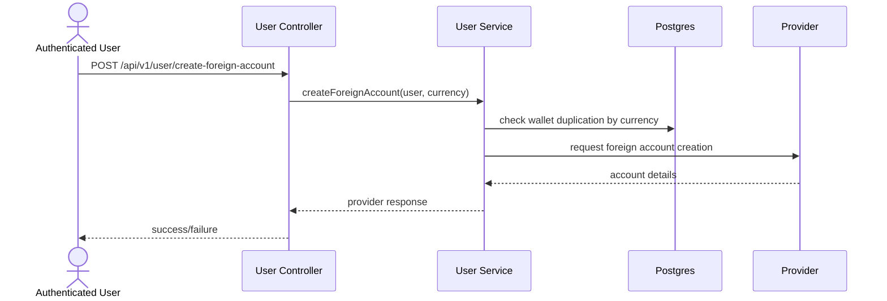
```mermaid
sequenceDiagram
  actor U as Authenticated User
  participant API as User Controller
  participant S as User Service
  participant DB as Postgres
  participant P as Provider

  U->>API: POST /api/v1/user/create-foreign-account
  API->>S: createForeignAccount(user, currency)
  S->>DB: check wallet duplication by currency
  S->>P: request foreign account creation
  P-->>S: account details
  S-->>API: provider response
  API-->>U: success/failure
```

## 19) Transfer Initiation (Internal vs External)
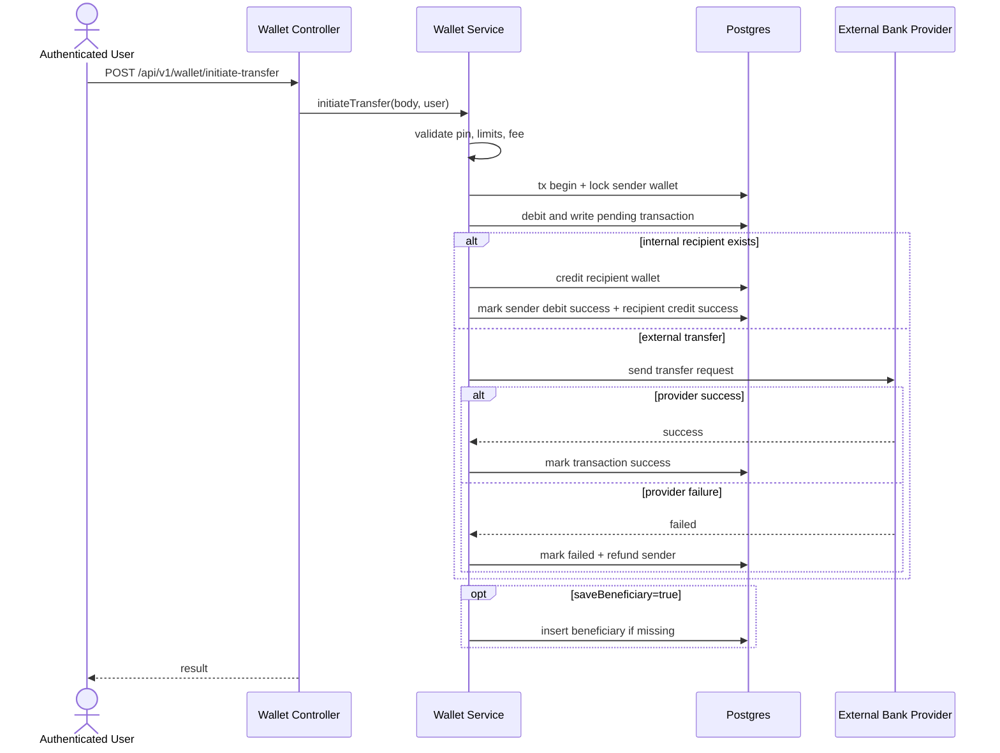
```mermaid
sequenceDiagram
  actor U as Authenticated User
  participant API as Wallet Controller
  participant S as Wallet Service
  participant DB as Postgres
  participant X as External Bank Provider

  U->>API: POST /api/v1/wallet/initiate-transfer
  API->>S: initiateTransfer(body, user)
  S->>S: validate pin, limits, fee
  S->>DB: tx begin + lock sender wallet
  S->>DB: debit and write pending transaction
  alt internal recipient exists
    S->>DB: credit recipient wallet
    S->>DB: mark sender debit success + recipient credit success
  else external transfer
    S->>X: send transfer request
    alt provider success
      X-->>S: success
      S->>DB: mark transaction success
    else provider failure
      X-->>S: failed
      S->>DB: mark failed + refund sender
    end
  end
  opt saveBeneficiary=true
    S->>DB: insert beneficiary if missing
  end
  API-->>U: result
```

## 20) QR Transfer (Generate and Decode)
```mermaid
sequenceDiagram
  actor U as Authenticated User
  participant API as Wallet Controller
  participant S as Wallet Service

  U->>API: GET /api/v1/wallet/generate-qrcode
  API->>S: generateQrCode(user)
  S-->>API: qr payload/image
  API-->>U: qr code

  U->>API: POST /api/v1/wallet/decode-qrcode
  API->>S: decodeQrCode(payload)
  S-->>API: recipient details
  API-->>U: decoded transfer target
```

## 21) Bill Plan Discovery and Variation
```mermaid
sequenceDiagram
  actor U as Authenticated User
  participant API as Bill Controller
  participant S as Bill Service
  participant DB as Postgres
  participant P as Bill Provider

  U->>API: GET /api/v1/bill/*/get-plan
  API->>S: get plan(s)
  S->>DB: fetch local catalog rows
  opt provider enrichment needed
    S->>P: fetch remote plans/metadata
  end
  API-->>U: plans

  U->>API: GET /api/v1/bill/*/get-variation
  API->>S: getVariation(operatorId)
  S->>P: fetch variations
  API-->>U: variations
```

## 22) Cable/Electricity Verification
```mermaid
sequenceDiagram
  actor U as Authenticated User
  participant API as Bill Controller
  participant S as Bill Service
  participant P as Bill Provider

  U->>API: POST verify cable/meter number
  API->>S: verifyBillerNumber(payload, type)
  S->>P: verify identifier
  alt valid
    P-->>S: customer details
    API-->>U: verified details
  else invalid
    P-->>S: provider 400
    S-->>API: mapped friendly error
    API-->>U: invalid meter/smartcard
  end
```

## 23) Bill Payment Generic Engine
```mermaid
sequenceDiagram
  actor U as Authenticated User
  participant API as Bill Controller
  participant S as Bill Service
  participant DB as Postgres
  participant P as Bill/Giftcard Provider
  participant N as SMS Notification

  U->>API: POST /api/v1/bill/{type}/pay
  API->>S: pay(body, user, billType)
  S->>S: validate wallet pin
  opt addBeneficiary=true
    S->>DB: create beneficiary if not existing
  end
  S->>DB: begin serializable tx
  S->>DB: lock wallet + check balance
  S->>DB: debit wallet
  S->>DB: create pending transaction
  S->>P: purchase operation
  alt success
    P-->>S: success payload
    S->>DB: update txn=success + billDetails
  else failure
    P-->>S: error
    S->>DB: update txn=failed
    S->>DB: refund wallet
  end
  opt notification
    S->>N: send sms alert (best effort)
  end
  API-->>U: final status
```

## 24) Gift Card Catalog/Rate/Redeem
```mermaid
sequenceDiagram
  actor U as Authenticated User
  participant API as Bill Controller
  participant S as Bill Service
  participant P as Giftcard Provider

  U->>API: GET /giftcard/get-categories
  API->>S: getGiftCardCategories()
  S->>P: fetch categories
  API-->>U: categories

  U->>API: GET /giftcard/get-product
  API->>S: getProductByISOCode(currency)
  S->>P: fetch products
  S-->>API: products + payable amount mapping
  API-->>U: products

  U->>API: GET /giftcard/get-fx-rate
  API->>S: getGiftCardFxRate(amount, currency)
  S->>P: fetch fx rate
  API-->>U: rate

  U->>API: GET /giftcard/get-redeem-code
  API->>S: redeemGiftCard(transactionId)
  S->>P: redeem
  API-->>U: redeem data
```

## 25) Bill Beneficiary List
```mermaid
sequenceDiagram
  actor U as Authenticated User
  participant API as Bill Controller
  participant S as Bill Service
  participant DB as Postgres

  U->>API: GET /api/v1/bill/beneficiary/list
  API->>S: getBenafiaries(user, billType)
  S->>DB: query beneficiary by user/type/filter
  DB-->>S: rows
  API-->>U: beneficiaries
```

## 26) Profile Summary and Beneficiary Retrieval
```mermaid
sequenceDiagram
  actor U as Authenticated User
  participant API as User Controller
  participant S as User Service
  participant DB as Postgres

  U->>API: GET /api/v1/user/me
  API->>S: getCurrentUser(user)
  S->>DB: fetch user profile + derived data
  API-->>U: profile summary

  U->>API: GET /api/v1/user/get-beneficiaries
  API->>S: getBeneficiaries(user, category)
  S->>DB: fetch beneficiaries
  API-->>U: beneficiary list
```

## 27) Statistics Line and Pie Charts
```mermaid
sequenceDiagram
  actor U as Authenticated User
  participant API as User Controller
  participant S as User Service
  participant DB as Postgres

  U->>API: GET /statistics-line-chart
  API->>S: getLineChart(user)
  S->>DB: aggregate successful txns by day/category
  DB-->>S: last 7-day series
  API-->>U: line chart payload

  U->>API: GET /statistics-pie-chart?sort=period
  API->>S: getPieChart(user, period)
  S->>DB: aggregate successful txns by category + period
  API-->>U: pie chart payload
```

## 28) Scam Report Submission
```mermaid
sequenceDiagram
  actor U as Authenticated User
  participant API as User Controller
  participant S as User Service
  participant F as File Storage
  participant DB as Postgres
  participant E as Email

  U->>API: POST /api/v1/user/report-scam (+ screenshot)
  API->>S: reportScam(user, payload, file)
  S->>F: upload screenshot
  F-->>S: screenshot URL
  S->>DB: create scam ticket (increment ref)
  S->>E: send acknowledgment email
  API-->>U: ticket created
```

## 29) Contact Us Submission
```mermaid
sequenceDiagram
  actor V as Visitor/User
  participant API as Core Controller
  participant S as Core Service
  participant E as Email

  V->>API: POST /api/v1/contact-us
  API->>S: contactUs(payload)
  S->>E: send acknowledgment to requester
  S->>E: notify support mailbox
  API-->>V: success
```

## 30) Admin Add/Delete Bill Plans
```mermaid
sequenceDiagram
  actor A as Admin User
  participant API as Admin Controller
  participant S as Admin Service
  participant DB as Postgres

  A->>API: POST /api/v1/admin/{domain}/add-plan
  API->>S: addPlan(payload)
  S->>DB: duplicate check
  alt duplicate
    API-->>A: conflict
  else not duplicate
    S->>DB: insert plan row
    API-->>A: created
  end

  A->>API: DELETE /api/v1/admin/delete-plan/:id/:bill_type
  API->>S: deletePlan(id, bill_type)
  S->>DB: delete from mapped plan table
  API-->>A: success
```

## 31) Payment Webhook Handling
```mermaid
sequenceDiagram
  participant P as Payment Provider
  participant API as Webhook Controller
  participant S as Webhook Service
  participant DB as Postgres

  P->>API: POST /api/v1/webhook/{provider}
  API->>API: validate provider secret header (where implemented)
  alt invalid signature
    API-->>P: rejected
  else accepted
    API->>S: process event payload
    S->>DB: persist paymentEvent
    S->>DB: route to success/failure wallet handlers
    API-->>P: ack
  end
```
