# Loan Module — Sequence Diagram

```mermaid
sequenceDiagram
    autonumber
    actor Farmer
    actor Admin
    participant ResourceAPI as Resource Catalog API<br/>/v1/loan-resources
    participant CartAPI as Cart API<br/>/v1/loan-cart
    participant FarmAPI as Farm API<br/>/v1/farms
    participant EligibilityAPI as Eligibility API<br/>/v1/loan-applications/eligibility-check
    participant LoanAPI as Loan Application API<br/>/v1/loan-applications
    participant AdminLoanAPI as Admin Loan API<br/>/v1/admin/loan-applications
    participant FulfillmentAPI as Fulfillment API<br/>/v1/admin/fulfillments
    participant MarketplaceOrderAPI as Marketplace Order API<br/>/v1/loan-applications/:id/marketplace-orders
    participant AdminMarketplaceAPI as Admin Marketplace API<br/>/v1/admin/marketplace-orders
    participant RepaymentAPI as Repayment API<br/>/v1/admin/repayments
    participant NotificationSvc as Notification Service<br/>(SMS + In-App)

    %% ─── PHASE 1: BROWSE & CART ───────────────────────────────────────────────

    rect rgb(230, 245, 255)
        Note over Farmer, ResourceAPI: Phase 1 — Browse Resources & Build Cart

        Farmer->>ResourceAPI: GET /loan-resource-categories
        ResourceAPI-->>Farmer: List of categories

        Farmer->>ResourceAPI: GET /loan-resources?category=&search=
        ResourceAPI-->>Farmer: Paginated resource list

        Farmer->>ResourceAPI: GET /loan-resources/:id
        ResourceAPI-->>Farmer: Resource detail (price, stock, supplier)

        Farmer->>CartAPI: POST /loan-cart/items { resourceId, quantity }
        CartAPI-->>Farmer: Cart with updated totals

        Farmer->>CartAPI: PATCH /loan-cart/items/:id { quantity }
        CartAPI-->>Farmer: Updated cart item

        Farmer->>CartAPI: DELETE /loan-cart/items/:id
        CartAPI-->>Farmer: Item removed

        Farmer->>CartAPI: GET /loan-cart
        CartAPI-->>Farmer: Full cart summary (items, totalValue)
    end

    %% ─── PHASE 2: FARM & ELIGIBILITY ──────────────────────────────────────────

    rect rgb(255, 250, 230)
        Note over Farmer, EligibilityAPI: Phase 2 — Farm Details & Eligibility Check

        Farmer->>FarmAPI: GET /farms
        FarmAPI-->>Farmer: Farmer's farms

        alt No farm yet
            Farmer->>FarmAPI: POST /farms { name, location, size, cropType, ... }
            FarmAPI-->>Farmer: Created farm
        end

        Farmer->>EligibilityAPI: POST /loan-applications/eligibility-check<br/>{ farmId, season, plantingDate, fulfillmentMethod }
        EligibilityAPI-->>Farmer: { eligible, checks[], blockingIssues[], warnings[] }

        alt Eligibility FAILED
            EligibilityAPI-->>Farmer: 400 — reasons (incomplete KYC / active loan / farm invalid)
            Note over Farmer: Farmer resolves issues and retries
        end
    end

    %% ─── PHASE 3: SUBMIT APPLICATION ──────────────────────────────────────────

    rect rgb(230, 255, 235)
        Note over Farmer, LoanAPI: Phase 3 — Submit Loan Application

        Farmer->>LoanAPI: POST /loan-applications<br/>{ farmId, purpose, season, plantingDate, harvestDate,<br/>  fulfillmentMethod, deliveryAddress, declarations, agentId? }
        LoanAPI-->>Farmer: Application created (status: Submitted)

        LoanAPI-)NotificationSvc: Trigger — Application Submitted SMS
        NotificationSvc-->>Farmer: SMS "Your application UBI-2026-XXXXX has been submitted"

        Farmer->>LoanAPI: GET /loan-applications
        LoanAPI-->>Farmer: List of my applications

        Farmer->>LoanAPI: GET /loan-applications/:id
        LoanAPI-->>Farmer: Application detail

        Farmer->>LoanAPI: GET /loan-applications/:id/timeline
        LoanAPI-->>Farmer: Status history timeline
    end

    %% ─── PHASE 4: ADMIN REVIEW ─────────────────────────────────────────────────

    rect rgb(255, 235, 230)
        Note over Admin, AdminLoanAPI: Phase 4 — Back-Office Review

        Admin->>AdminLoanAPI: GET /admin/loan-applications?status=Submitted
        AdminLoanAPI-->>Admin: Paginated application queue

        Admin->>AdminLoanAPI: GET /admin/loan-applications/:id
        AdminLoanAPI-->>Admin: Full detail (farmer, farm, cart items, eligibility checks)

        Admin->>AdminLoanAPI: GET /admin/loan-applications/:id/audit-log
        AdminLoanAPI-->>Admin: Audit trail

        alt Admin sends for Field Verification
            Admin->>AdminLoanAPI: POST /admin/loan-applications/:id/assign-agent { agentId, note }
            AdminLoanAPI-->>Admin: Agent assigned

            Admin->>AdminLoanAPI: POST /admin/loan-applications/:id/status<br/>{ status: PendingFieldVerification, reason }
            AdminLoanAPI-->>Admin: Status updated

            Note over Admin: Agent submits field verification report (agent flow)
            Admin->>AdminLoanAPI: GET /admin/loan-applications/verification-queue
            AdminLoanAPI-->>Admin: Pending verifications

            Admin->>AdminLoanAPI: POST /admin/loan-applications/:id/status<br/>{ status: UnderReview }
            AdminLoanAPI-->>Admin: Returned to review
        end

        alt Admin requests More Information
            Admin->>AdminLoanAPI: POST /admin/loan-applications/:id/decision<br/>{ decision: more_info_required, reason, note }
            AdminLoanAPI-->>Admin: Status → MoreInfoRequired
            AdminLoanAPI-)NotificationSvc: Trigger — More Info Required
            NotificationSvc-->>Farmer: SMS "Additional information required"
        end

        alt Admin REJECTS Application
            Admin->>AdminLoanAPI: POST /admin/loan-applications/:id/decision<br/>{ decision: rejected, reason, note }
            AdminLoanAPI-->>Admin: Status → Rejected
            AdminLoanAPI-)NotificationSvc: Trigger — Application Rejected
            NotificationSvc-->>Farmer: SMS "Your application was declined"
        end

        alt Admin APPROVES Application
            Admin->>AdminLoanAPI: POST /admin/loan-applications/:id/decision<br/>{ decision: approved, reason, approvedItems[], repaymentTerms, supplierId }
            AdminLoanAPI-->>Admin: Status → Approved
            AdminLoanAPI-)NotificationSvc: Trigger — Application Approved
            NotificationSvc-->>Farmer: SMS "Your Farm Input Loan has been approved"
        end
    end

    %% ─── PHASE 4.5: MARKETPLACE REDEMPTION ────────────────────────────────────

    rect rgb(230, 240, 220)
        Note over Farmer, AdminMarketplaceAPI: Phase 4.5 — Marketplace Redemption (Farmer spends approved loan credit)

        Note over Farmer, AdminMarketplaceAPI: Admin uploads farming materials to Marketplace
        Admin->>ResourceAPI: POST /admin/loan-resources { name, unitPrice, stockQuantity, ... }
        ResourceAPI-->>Admin: Resource created / updated

        Farmer->>MarketplaceOrderAPI: GET .../credit-summary
        MarketplaceOrderAPI-->>Farmer: { approved, spent, available }

        Farmer->>ResourceAPI: GET /loan-resources?category=&search=
        ResourceAPI-->>Farmer: Marketplace catalog

        Farmer->>MarketplaceOrderAPI: POST /loan-applications/:id/marketplace-orders<br/>{ items: [{ resourceId, quantity }], deliveryMethod, deliveryAddress }
        Note over MarketplaceOrderAPI: Validates: Approved status, stock per item, orderTotal ≤ availableCredit (Serializable tx)
        MarketplaceOrderAPI-->>Farmer: Order created (status: pending, ref: MKT-xxxx)
        MarketplaceOrderAPI-)NotificationSvc: Trigger — Order Placed SMS
        NotificationSvc-->>Farmer: SMS "Your marketplace order MKT-xxxx has been placed"

        Farmer->>MarketplaceOrderAPI: GET /loan-applications/:id/marketplace-orders
        MarketplaceOrderAPI-->>Farmer: List of orders

        alt Farmer cancels a pending order
            Farmer->>MarketplaceOrderAPI: POST .../marketplace-orders/:orderId/cancel
            MarketplaceOrderAPI-->>Farmer: Status → cancelled (stock unchanged)
            MarketplaceOrderAPI-)NotificationSvc: Trigger — Order Cancelled SMS
        end

        Admin->>AdminMarketplaceAPI: GET /admin/marketplace-orders?status=pending
        AdminMarketplaceAPI-->>Admin: Pending orders queue

        Admin->>AdminMarketplaceAPI: POST /admin/marketplace-orders/:orderId/confirm<br/>{ supplierId?, adminNote? }
        Note over AdminMarketplaceAPI: Re-validates stock → decrements LoanResource.stockQuantity in tx
        AdminMarketplaceAPI-->>Admin: Status → confirmed
        AdminMarketplaceAPI-)NotificationSvc: Trigger — Order Confirmed SMS
        NotificationSvc-->>Farmer: SMS "Your marketplace order MKT-xxxx has been confirmed"

        Admin->>AdminMarketplaceAPI: POST /admin/marketplace-orders/:orderId/pack
        AdminMarketplaceAPI-->>Admin: Status → packed

        Admin->>AdminMarketplaceAPI: POST /admin/marketplace-orders/:orderId/dispatch
        AdminMarketplaceAPI-->>Admin: Status → dispatched
        AdminMarketplaceAPI-)NotificationSvc: Trigger — Order Dispatched SMS
        NotificationSvc-->>Farmer: SMS "Your marketplace order MKT-xxxx is on its way"

        Admin->>AdminMarketplaceAPI: POST /admin/marketplace-orders/:orderId/deliver<br/>{ receivedBy, deliveryProofUrl, deliveryNote }
        AdminMarketplaceAPI-->>Admin: Status → delivered
        AdminMarketplaceAPI-)NotificationSvc: Trigger — Order Delivered SMS
        NotificationSvc-->>Farmer: SMS "Your marketplace order MKT-xxxx has been delivered"

        alt Admin cancels a confirmed order (stock re-credited)
            Admin->>AdminMarketplaceAPI: POST /admin/marketplace-orders/:orderId/cancel { cancelReason }
            Note over AdminMarketplaceAPI: Increments LoanResource.stockQuantity for each item
            AdminMarketplaceAPI-->>Admin: Status → cancelled, stock restored
            AdminMarketplaceAPI-)NotificationSvc: Trigger — Order Cancelled SMS
        end
    end

    %% ─── PHASE 5: FULFILLMENT ──────────────────────────────────────────────────

    rect rgb(240, 230, 255)
        Note over Admin, FulfillmentAPI: Phase 5 — Admin-Initiated Fulfillment & Delivery<br/>(original approved input package, runs in parallel with Marketplace Orders)

        Admin->>FulfillmentAPI: GET /admin/suppliers
        FulfillmentAPI-->>Admin: Active suppliers list

        Admin->>FulfillmentAPI: POST /admin/loan-applications/:id/fulfillment<br/>{ supplierId, deliveryMethod, items[], deliveryOfficer, ... }
        FulfillmentAPI-->>Admin: Fulfillment record created (status: FulfillmentInProgress)
        FulfillmentAPI-)NotificationSvc: Trigger — Fulfillment Started
        NotificationSvc-->>Farmer: SMS "Your inputs are being prepared"

        Admin->>FulfillmentAPI: GET /admin/fulfillments
        FulfillmentAPI-->>Admin: List of fulfillments

        Admin->>FulfillmentAPI: POST /admin/fulfillments/:id/dispatch
        FulfillmentAPI-->>Admin: Status → ReadyForPickup or OutForDelivery
        FulfillmentAPI-)NotificationSvc: Trigger — Inputs Ready / Dispatched
        NotificationSvc-->>Farmer: SMS "Your inputs are ready / on the way"

        Farmer->>LoanAPI: GET /loan-applications/:id
        LoanAPI-->>Farmer: Updated status (ReadyForPickup / OutForDelivery)

        Admin->>FulfillmentAPI: POST /admin/fulfillments/:id/deliver<br/>{ receivedBy, deliveryProofUrl, deliveryNote }
        FulfillmentAPI-->>Admin: Status → Delivered → Active
        FulfillmentAPI-)NotificationSvc: Trigger — Inputs Delivered
        NotificationSvc-->>Farmer: SMS "Your inputs have been delivered. Loan is now active."
    end

    %% ─── PHASE 6: REPAYMENT ────────────────────────────────────────────────────

    rect rgb(230, 255, 250)
        Note over Farmer, RepaymentAPI: Phase 6 — Repayment Lifecycle

        Farmer->>LoanAPI: GET /loan-applications/:id/repayment-schedule
        LoanAPI-->>Farmer: Repayment plan (installments, due dates, balance)

        Admin->>RepaymentAPI: GET /admin/repayments?overdueOnly=false
        RepaymentAPI-->>Admin: All repayment plans

        Note over RepaymentAPI: Scheduled job — daily
        RepaymentAPI-)RepaymentAPI: POST /admin/repayments/jobs/process-overdue
        RepaymentAPI-)NotificationSvc: Trigger — Overdue Reminder
        NotificationSvc-->>Farmer: SMS "Your loan repayment is overdue"

        RepaymentAPI-)RepaymentAPI: POST /admin/repayments/jobs/send-reminders
        RepaymentAPI-)NotificationSvc: Trigger — Upcoming Due Date Reminder
        NotificationSvc-->>Farmer: SMS "Repayment due in X days"

        Admin->>RepaymentAPI: POST /admin/repayments/:applicationId/record<br/>{ amountPaid, reference, note }
        RepaymentAPI-->>Admin: Payment recorded (status: PartiallyRepaid or Completed)

        alt Loan Fully Repaid
            RepaymentAPI-)NotificationSvc: Trigger — Loan Completed
            NotificationSvc-->>Farmer: SMS "Congratulations! Your loan is fully repaid."
        end
    end

    %% ─── CANCELLATION ──────────────────────────────────────────────────────────

    rect rgb(255, 240, 240)
        Note over Farmer, LoanAPI: Optional — Cancel Application

        Farmer->>LoanAPI: POST /loan-applications/:id/cancel
        LoanAPI-->>Farmer: Status → Cancelled (only from Draft or Submitted)
    end

    %% ─── ADMIN REPORTS ─────────────────────────────────────────────────────────

    rect rgb(245, 245, 245)
        Note over Admin, AdminLoanAPI: Admin — Reporting

        Admin->>AdminLoanAPI: GET /admin/loan-reports/summary
        AdminLoanAPI-->>Admin: Portfolio stats (total, approved, rejected, overdue)

        Admin->>AdminLoanAPI: GET /admin/loan-reports/overdue
        AdminLoanAPI-->>Admin: All overdue loans

        Admin->>AdminLoanAPI: GET /admin/loan-reports/top-items
        AdminLoanAPI-->>Admin: Top 10 most requested resources
    end
```



---

## Status Transition Reference

```
Draft
  └─▶ Submitted
        └─▶ EligibilityReview
              └─▶ UnderReview
                    ├─▶ MoreInfoRequired ──▶ UnderReview (after farmer updates)
                    ├─▶ PendingFieldVerification ──▶ UnderReview
                    ├─▶ Rejected
                    └─▶ Approved
                          └─▶ FulfillmentInProgress
                                ├─▶ ReadyForPickup ──▶ Delivered
                                └─▶ OutForDelivery ──▶ Delivered
                                                          └─▶ Active
                                                                ├─▶ PartiallyRepaid
                                                                │     ├─▶ Completed
                                                                │     └─▶ Overdue
                                                                └─▶ Overdue

Any status before Approved ──▶ Cancelled
```

---

## Marketplace Order Status Transitions

```
pending
  ├─▶ confirmed (admin confirms, stock deducted)
  │     ├─▶ packed
  │     │     └─▶ dispatched
  │     │               └─▶ delivered
  │     └─▶ cancelled (admin only — stock re-credited)
  └─▶ cancelled (farmer, before confirmation — no stock change)
```

Note: Marketplace Orders are independent of the loan's primary status. The loan stays in `Approved` throughout. Repayment obligations are unchanged.

---

## Actors & Systems

| Actor | Role |
|-------|------|
| **Farmer** | Browses marketplace, manages cart, submits/tracks application, places marketplace orders |
| **Admin** | Uploads farming materials, reviews applications, makes decisions, manages fulfillment and marketplace orders |
| **Field Agent** | Verifies farm on the ground, submits verification report |
| **Notification Service** | Sends SMS and in-app notifications on every major event |
| **Repayment Scheduler** | Background jobs for overdue processing and reminders |
